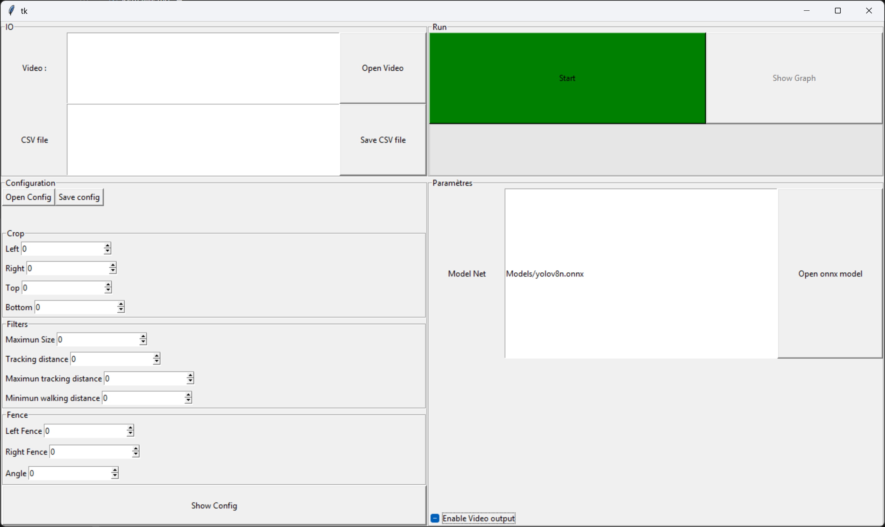
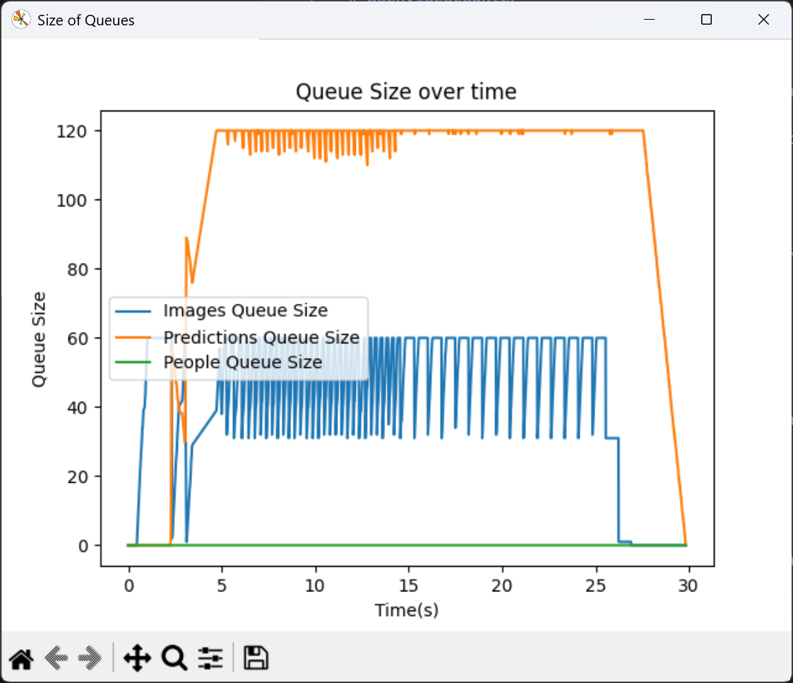

# OpenVideocounter

## AN video counter to calculate infulence of an event

With the simple use of a camera feed, an detection models, an simple tracking

## How to use it

- open the video file, compatible with opencv reader
- open where to save the report csv file
- open or define a configuration in the config section
- open the Yolo models
- Click Start to run it and the progress run

## Show graph
That show the graph of all queue size during the computiong job

## Show config
If a video is open that show the configuration applied on the video

## Save Config
To save the configuration in a file to use it another time

## Extra Informations
- During the computation time, some imformations are ouputed on the CLI
- Multiples instance can be launched in parallel

## Issues 
Use the github issues section